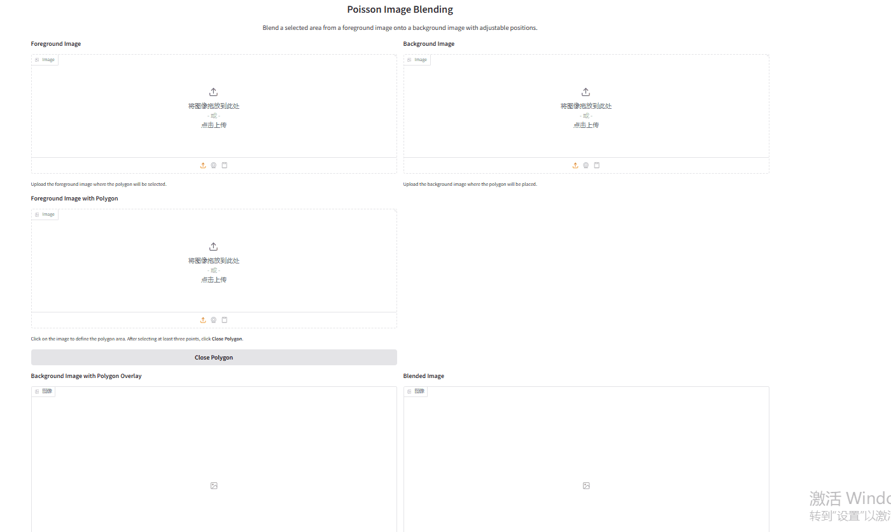

# Assignment 2 - DIP with PyTorch

  ### In this assignment, you will implement traditional DIP (Poisson Image Editing) and deep learning-based DIP
  (Pix2Pix) with PyTorch.

  ### Resources:
  - [Assignment Slides](https://pan.ustc.edu.cn/share/index/66294554e01948acaf78)
  - [Paper: Poisson Image Editing](https://www.cs.jhu.edu/~misha/Fall07/Papers/Perez03.pdf)
  - [Paper: Image-to-Image Translation with Conditional Adversarial Nets](https://phillipi.github.io/pix2pix/)
  - [Paper: Fully Convolutional Networks for Semantic Segmentation](https://arxiv.org/abs/1411.4038)
  - [PyTorch Installation & Docs](https://pytorch.org/)

  ### 1. Implement Poisson Image Editing with PyTorch.
  Fill the [Polygon to Mask function](run_blending_gradio.py#L95) and the [Laplacian Distance Computation]
  (run_blending_gradio.py#L115) of `run_blending_gradio.py`.

  ### 2. Pix2Pix implementation.
  See [Pix2Pix subfolder](Pix2Pix/).

  ---

  ## Implementation of Poisson Image Editing and Pix2Pix

  This repository is my implementation of Assignment 2 of DIP.

  

  ## Requirements

  To install requirements:

  ```setup
  python -m pip install -r requirements.txt

  ## Running

  To run Poisson Image Editing, run:

  python run_blending_gradio.py

  To run Pix2Pix training, run:

  cd Pix2Pix
  bash download_facades_dataset.sh
  python train.py

  ## Results

  ### Poisson Image Editing
  

  ### Pix2Pix Training Result
  

  ### Pix2Pix Validation Result
  

  ## Acknowledgement

  > Thanks for the ideas from Poisson Image Editing (https://www.cs.jhu.edu/~misha/Fall07/Papers/Perez03.pdf) and Pix2P
  > ix (https://phillipi.github.io/pix2pix/).
