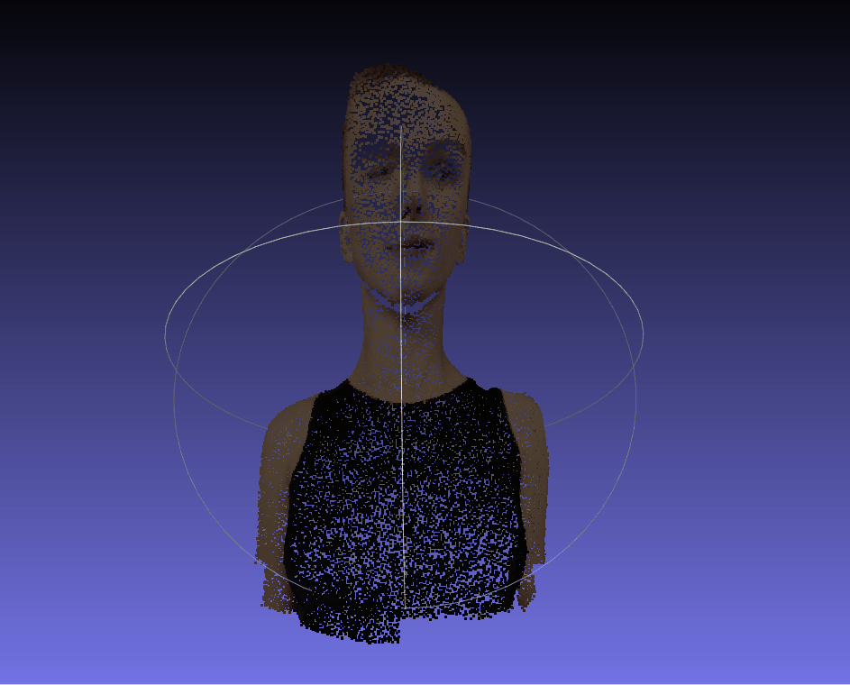
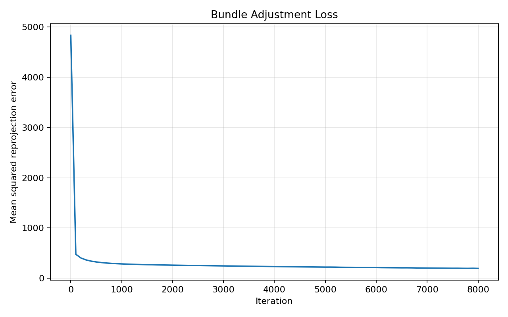
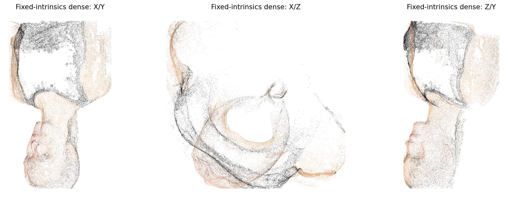

# Assignment 3 - Bundle Adjustment

### In this assignment, I implemented Bundle Adjustment with PyTorch and used COLMAP to reconstruct a 3D model from multi-view images.

### Resources
- [Teaching Slides](https://pan.ustc.edu.cn/share/index/66294554e01948acaf78)
- [Bundle Adjustment - Wikipedia](https://en.wikipedia.org/wiki/Bundle_adjustment)
- [PyTorch Optimization](https://pytorch.org/docs/stable/optim.html)
- [COLMAP Documentation](https://colmap.github.io/)
- [COLMAP CLI Tutorial](https://colmap.github.io/cli.html)

### 1. Bundle Adjustment with PyTorch

The first task optimizes a shared focal length, per-view camera extrinsics, and all 3D point coordinates from the provided 2D projections. The projection model follows the assignment coordinate system:

```text
Xc = R @ X + T
u = -f * Xc / Zc + cx
v =  f * Yc / Zc + cy
```

The rotation is parameterized by Euler angles. The optimization objective is the mean squared reprojection error over all visible 2D observations.

### 2. 3D Reconstruction with COLMAP

The second task runs a standard COLMAP pipeline on the rendered images in `data/images/`:

1. Feature extraction
2. Exhaustive feature matching
3. Sparse reconstruction / mapper
4. Image undistortion
5. PatchMatch Stereo
6. Stereo Fusion

For the final dense result, I fixed the COLMAP camera intrinsics to the focal length recovered in Task 1. This gives a more stable reconstruction for this synthetic face sequence, because estimating focal length only from weakly textured rendered images can produce an inaccurate calibration.

---

## Implementation of Bundle Adjustment and COLMAP Reconstruction

This repository is my implementation of Assignment 3 of DIP.



## Requirements

The main Python dependencies are:

```bash
python -m pip install torch torchvision --index-url https://download.pytorch.org/whl/cu126
python -m pip install numpy matplotlib pycolmap
```

Task 1 is implemented with PyTorch and CUDA. The submitted run was executed on an NVIDIA GeForce RTX 3050 Laptop GPU.

Task 2 uses COLMAP. Sparse reconstruction can be run with `pycolmap`; dense PatchMatch Stereo requires a CUDA-enabled COLMAP build.

## Running

To run PyTorch Bundle Adjustment:

```bash
python ba_pytorch.py \
  --data-dir data \
  --output-dir outputs/task1 \
  --iters 8000 \
  --batch-points 20000 \
  --device cuda:0
```

To run the original COLMAP command line pipeline:

```bash
bash run_colmap.sh
```

To run the Python COLMAP pipeline:

```bash
python run_colmap_py.py \
  --image-dir data/images \
  --output-dir outputs/task2_colmap \
  --overwrite \
  --device auto \
  --max-image-size 1024
```

For the final dense reconstruction, I used a CUDA-enabled Windows COLMAP build for PatchMatch Stereo and Stereo Fusion, with camera intrinsics fixed to:

```text
PINHOLE, fx=1481.48, fy=1481.48, cx=512, cy=512
```

## Results

### Task 1: PyTorch Bundle Adjustment

The optimization recovered all 20000 3D points, 50 camera poses, and a shared focal length.

| Item | Value |
| --- | ---: |
| Device | NVIDIA GeForce RTX 3050 Laptop GPU |
| Views | 50 |
| 3D points | 20000 |
| Iterations | 8000 |
| Final full reprojection loss | 197.832260 |
| Optimized focal length | 1481.480347 |

Loss curve:



Reconstructed point cloud visualization:


The optimized colored point cloud is saved as:

```text
outputs/task1/optimized_points3d.obj
```

### Task 2: COLMAP Sparse and Dense Reconstruction

The COLMAP sparse reconstruction registered all 50 images. With the fixed focal length from Task 1, the sparse model became more stable and produced more observations.

| Item | Value |
| --- | ---: |
| Registered images | 50 |
| Sparse 3D points | 3082 |
| Sparse observations | 25467 |
| Mean reprojection error | 0.948124 px |
| Dense PatchMatch time | 32.605 min |
| Dense fused points | 220414 |

Dense reconstruction preview:



The submitted COLMAP point cloud files are:

```text
pics/sparse_points.ply
pics/fused.ply
```

## Discussion

Task 1 uses the provided 2D point correspondences, so the recovered 3D point cloud is clean and directly follows the assignment's Bundle Adjustment formulation.

Task 2 only uses rendered RGB images. Since the face images contain large weakly textured regions and a white background, COLMAP's automatic focal length estimation is less reliable. I therefore reused the Task 1 focal length as a fixed intrinsic prior for the final COLMAP run, which improved the sparse and dense reconstruction quality.

## Acknowledgement

Thanks for the ideas and tools from Bundle Adjustment, PyTorch, and COLMAP.
