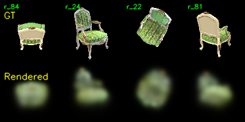
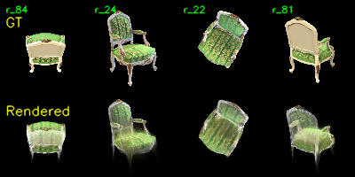
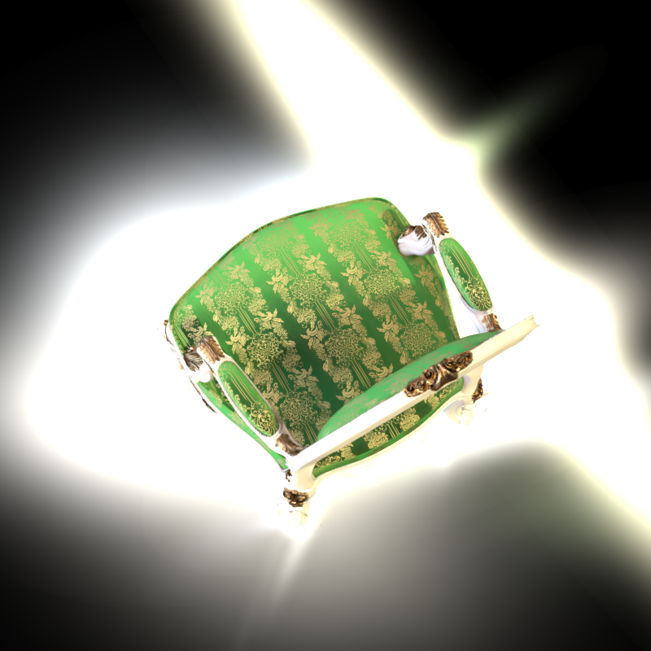

# Assignment 4 - 3D Gaussian Splatting

### In this assignment, you will: (1) recover camera parameters and sparse 3D points with COLMAP, (2) implement a simplified 3D Gaussian Splatting renderer in PyTorch, and (3) compare it with the official 3DGS implementation.

### Resources:
- [Teaching Slides](https://pan.ustc.edu.cn/share/index/66294554e01948acaf78)
- [Paper: 3D Gaussian Splatting for Real-Time Radiance Field Rendering](https://repo-sam.inria.fr/fungraph/3d-gaussian-splatting/3d_gaussian_splatting_low.pdf)
- [Official 3DGS Implementation](https://github.com/graphdeco-inria/gaussian-splatting)
- [COLMAP Documentation](https://colmap.github.io/)
- [PyTorch Documentation](https://pytorch.org/docs/stable/index.html)

---

### Background

3D Gaussian Splatting 将一个场景表示为一组带有位置、颜色、不透明度、旋转和尺度的 3D Gaussian。每个 3D Gaussian 会被投影到图像平面上，得到 2D Gaussian，并通过 alpha blending 累积成最终图像。

本次作业的目标是完成一个简化版 3DGS pipeline：

1. 使用 COLMAP 从多视角图像中恢复相机参数和稀疏点云。
2. 将稀疏点云初始化为一组可优化的 3D Gaussian。
3. 用 PyTorch 实现 3D Gaussian 到 2D Gaussian 的投影、Gaussian 取值和 alpha blending。
4. 使用官方 3DGS 实现进行同数据集对比，分析渲染质量、训练速度和显存占用差异。

### Data

本次实验使用 `chair` 场景，共 100 张多视角图像：

```text
data/
└── chair/
    ├── images/              # 100 张 multi-view images
    ├── sparse/0/            # COLMAP binary sparse model
    ├── sparse/0_text/       # COLMAP text sparse model
    └── projections/r_0.png  # Task 1 projection verification sample
```

COLMAP 输出的 sparse model 包含：

```text
data/chair/sparse/0/cameras.bin
data/chair/sparse/0/images.bin
data/chair/sparse/0/points3D.bin
```

### Known Information

| 参数 | 值 | 说明 |
|------|-----|------|
| Scene | chair | 本次实验使用的物体场景 |
| Num Images | 100 | 多视角输入图像数量 |
| Image Size | 800 x 800 | 原始图像分辨率 |
| COLMAP Points | 13,659 | Task 1 恢复出的 sparse 3D points |
| Simplified 3DGS Points | 3,000 | Task 2 中采样用于优化的 Gaussian 数量 |

---

## Task 1: Structure-from-Motion with COLMAP

Task 1 使用 COLMAP 对 `data/chair/images/` 中的 100 张图像进行 Structure-from-Motion，恢复相机内参、相机外参和稀疏 3D 点云。

运行命令：

```bash
python mvs_with_colmap.py --data_dir data/chair
```

为了验证 COLMAP 恢复结果，我将稀疏 3D 点重新投影回图像平面，并叠加到原图上：

```bash
python debug_mvs_by_projecting_pts.py --data_dir data/chair
```

**Projection verification:**


Task 1 结果：

| Item | Value |
| --- | ---: |
| Input images | 100 |
| Registered images | 100 |
| Sparse 3D points | 13,659 |
| Output binary model | `data/chair/sparse/0` |
| Output text model | `data/chair/sparse/0_text` |

---

## Task 2: Simplified 3D Gaussian Splatting

Task 2 实现了一个纯 PyTorch 的简化版 3DGS。核心实现包括：

1. **3D Gaussian Initialization**：使用 COLMAP sparse points 初始化 Gaussian 的位置和颜色。
2. **3D Covariance Construction**：由 quaternion rotation 和 scaling vector 构造 3D covariance matrix。
3. **Projection to 2D**：使用投影 Jacobian 将 3D covariance 投影为 image-space 2D covariance。
4. **2D Gaussian Evaluation**：计算每个 Gaussian 在像素位置上的响应。
5. **Alpha Blending**：按深度排序后进行 alpha blending，得到最终 RGB 图像。

训练命令：

```bash
python train.py \
  --colmap_dir data/chair \
  --checkpoint_dir data/chair/checkpoints_h8008 \
  --num_epochs 200 \
  --device cuda \
  --maximum_points 3000 \
  --downsample_factor 8
```

渲染命令：

```bash
python render_3dgs_mv.py \
  --colmap_dir data/chair \
  --checkpoint results/task2/checkpoints_backup/checkpoint_000180.pt \
  --num_frames 240 \
  --fps 30 \
  --device cuda
```

Task 2 在远端 H800 GPU 上完成训练。为了让纯 PyTorch renderer 可以稳定运行，我对输入图像做了 `downsample_factor=8`，并从 COLMAP sparse points 中采样 3,000 个点作为 Gaussian 初始化。

| Item | Value |
| --- | ---: |
| GPU | NVIDIA H800 PCIe |
| Training epochs | 200 |
| Training wall time | 39 min 36 s |
| Input COLMAP points | 13,659 |
| Optimized Gaussians | 3,000 |
| Downsample factor | 8 |
| Last logged loss | 0.0403 |
| Peak GPU memory | 3,237 MB |

**Training visualization:**





Task 2 结果文件：

```text
results/task2/debug_rendering.mp4
results/task2/checkpoints_backup/checkpoint_000180.pt
results/task2/logs/
```

---

## Task 3: Compare with the Official 3DGS Implementation

Task 3 使用官方 [graphdeco-inria/gaussian-splatting](https://github.com/graphdeco-inria/gaussian-splatting) 代码，在相同的 `chair` 数据集上训练官方 3DGS 模型，并与 Task 2 的简化版 PyTorch 实现进行对比。

官方 3DGS 训练命令：

```bash
python train.py \
  -s /public/home/ba25001026/3DGS/data/chair \
  -m /public/home/ba25001026/3DGS/task3_official/output/chair_h8008 \
  --disable_viewer \
  --test_iterations -1
```

官方 3DGS 渲染命令：

```bash
python render.py \
  -s /public/home/ba25001026/3DGS/data/chair \
  -m /public/home/ba25001026/3DGS/task3_official/output/chair_h8008 \
  --skip_test
```

官方实验的 Slurm 脚本保存在：

```text
hpc_task3/
```

### Quantitative Comparison

| Item | Simplified PyTorch 3DGS | Official 3DGS |
| --- | ---: | ---: |
| GPU | NVIDIA H800 PCIe | NVIDIA H800 PCIe |
| Input scene | `data/chair` | `data/chair` |
| Initial COLMAP points | 13,659 | 13,659 |
| Optimized Gaussians | 3,000 fixed sampled points | 366,474 final Gaussians |
| Training setting | 200 epochs, downsample factor 8 | 30,000 iterations |
| Training wall time | 39 min 36 s | 5 min 46 s |
| Full job wall time | 39 min 36 s | 6 min 15 s |
| Peak GPU memory | 3,237 MB | 2,773 MB |

**Official 3DGS rendering samples:**





Task 3 结果文件：

```text
results/task3/official_train_renders.mp4
results/task3/point_cloud/point_cloud.ply
results/task3/comparison_summary.md
results/task3/logs/
```

---

## Implementation of 3DGS Assignment

This repository is my implementation of Assignment 4 of DIP.

简化版 PyTorch 3DGS 结果：


官方 3DGS 结果：


## Requirements

主要 Python 依赖：

```bash
python -m pip install -r requirements.txt
```

如果需要安装 PyTorch CUDA 版本，可参考：

```bash
python -m pip install torch torchvision --index-url https://download.pytorch.org/whl/cu126
```

Task 1 需要安装 COLMAP：

```bash
colmap -h
```

Task 3 需要官方 3DGS 代码及其 CUDA extension：

```bash
git clone --recursive https://github.com/graphdeco-inria/gaussian-splatting.git
pip install submodules/diff-gaussian-rasterization
pip install submodules/simple-knn
pip install submodules/fused-ssim
```

## Running

运行 Task 1：

```bash
python mvs_with_colmap.py --data_dir data/chair
python debug_mvs_by_projecting_pts.py --data_dir data/chair
```

运行 Task 2：

```bash
python train.py \
  --colmap_dir data/chair \
  --checkpoint_dir data/chair/checkpoints_h8008 \
  --num_epochs 200 \
  --device cuda \
  --maximum_points 3000 \
  --downsample_factor 8
```

运行 Task 3 的远端作业脚本：

```bash
sbatch hpc_task3/job_official_h800.slurm
```

## Discussion

简化版 PyTorch 3DGS 实现了 3DGS 的核心数学流程，包括 covariance 构造、3D 到 2D 投影、Gaussian 取值以及 alpha blending。因此它适合用于理解算法原理。

但是，简化版实现的渲染质量和效率都明显弱于官方实现。主要原因有三点：

1. 简化版只使用固定的 3,000 个 Gaussian，不能根据梯度自适应增加或删除 Gaussian。
2. 简化版直接使用 PyTorch tensor 操作实现渲染，会产生较大的中间张量。
3. 官方实现使用 tile-based CUDA rasterizer、visibility-aware rendering、adaptive densification 和 pruning，因此速度更快、显存效率更高，重建结果也更清晰。

在本次实验中，官方 3DGS 从相同的 13,659 个 COLMAP sparse points 出发，最终得到 366,474 个 Gaussian。官方实现只用了 5 min 46 s 完成训练，而简化版训练 200 epochs 需要 39 min 36 s。显存方面，官方实现峰值约 2,773 MB，简化版采样峰值约 3,237 MB。

## Acknowledgement

Thanks for the ideas and tools from 3D Gaussian Splatting, COLMAP, PyTorch, and the official GraphDECO 3DGS implementation.
